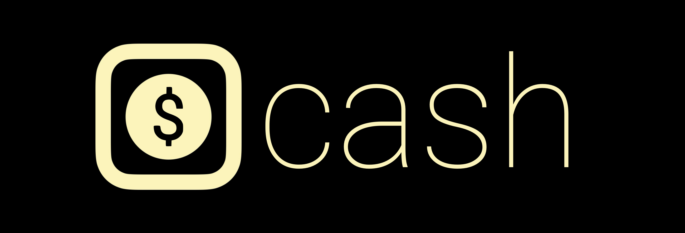

<div align="center">



# CASH - A Simple Command and Script Shell
[](LICENSE) []() []() []()

---

**CASH** (*Command and Script Shell Advanced*) is a simple yet powerful shell built in C to explore **kernel processes, system calls, shell internals**, and **basic scripting**.  
This project serves as a **learning exercise** and a **foundation** for understanding how shells interact with the OS, manage processes, and execute commands — with real, modern features.

---

## 💻 Features
✅ Minimalist and lightweight shell implementation  
✅ Command execution with argument parsing  
✅ Process management using system calls  
✅ Basic built-in commands (`cd`, `exit`, etc.)  
✅ Background process execution (`&`)  
✅ Input and output redirection (`>`, `<`)  
✅ Piping between commands (`|`)  
✅ (Experimental) Simple script file execution  
✅ Extensible design for future features  

---

## 🛠 Installation

</div>

### 1️⃣ Clone the Repository
```bash
git clone https://github.com/yourusername/cash.git
cd cash
```

### 2️⃣ Build the Shell
```bash
make
```

### 3️⃣ Run CASH
```bash
./cash
```

*(Optional: Move to `/usr/local/bin` for global access)*
```bash
sudo cp cash /usr/local/bin
```

---

## 📌 Usage
Start CASH by running:
```bash
cash
```

Use it like a normal shell:
```bash
ls -l
echo "Hello, CASH!"
pwd
```

To exit, type:
```bash
exit
```

---

## ✅ Supported Functionalities

### **1. Basic Commands**
Run external system commands with arguments:
```bash
ls -l
mkdir test
rm file.txt
```

### **2. Built-in Commands**
Internal commands handled by CASH itself:
```bash
cd /path/to/dir
exit
help
```

### **3. Background Processes**
Add `&` at the end to run commands in the background:
```bash
sleep 10 &
firefox &
```

### **4. Input/Output Redirection**
Redirect output to a file, or read input from a file:
```bash
ls > files.txt
sort < unsorted.txt
```

### **5. Piping**
Chain commands using pipes (`|`):
```bash
ls -l | grep "txt"
cat file.txt | wc -l
```

### **6. (Experimental) Scripting Support**
Basic execution of `.cash` script files (simple sequences of commands):
```bash
cash script.cash
```

---

## 🌟 Example Use Cases

```bash
# List all `.c` files
ls *.c

# Count lines in all `.txt` files
cat *.txt | wc -l

# Create, write, and display a file
echo "Hello CASH" > hello.txt
cat hello.txt

# Sleep in background
sleep 30 &

# Script execution (if script file contains CASH commands)
./myscript.cash
```

---

<div align="center">

## 🔮 Roadmap
| Feature                          | Status      |
|----------------------------------|-------------|
| ✅ Command execution | Completed |
| ✅ Built-in commands | Completed |
| ✅ Background process handling | Completed |
| ✅ Redirection (`>`, `<`) | Completed |
| ✅ Piping (`|`) | Completed |
| ✅ (Basic) Script file support | Completed |
| ✅ Command history (`arrow keys` navigation) | Completed |
| ⏳ Auto-completion (`tab` key) | Planning |
| ⏳ Alias and environment variable support | Planning |
| ⏳ Advanced scripting capabilities | Planning |
| ⏳ Configuration file (`.cashrc` for startup customization) | Planning |

---

## **👨‍💻 Dev Team**

Just me, actually.

| Name                      | Institution             | ID | GitHub | Followers |
|---------------------------|-------------------------|--  |--------|------|
| **Rajin Khan**            | North South University | 2212708042 | [](https://github.com/rajin-khan) |  |

---

### ⭐ **Star this repo if you want more cool stuff like this!**

## 🚀 Want to Contribute?

cash is open-source, and minimalist. PRs are welcome!

</div>